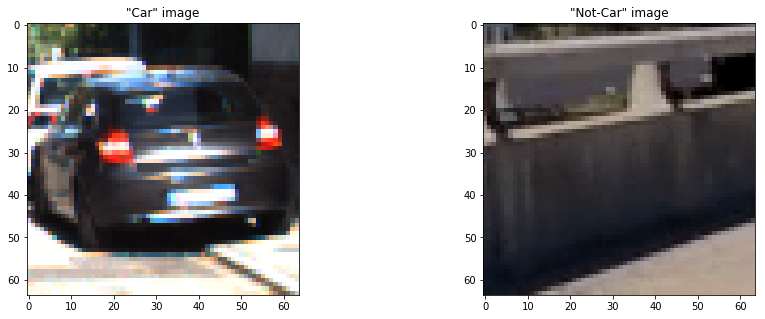
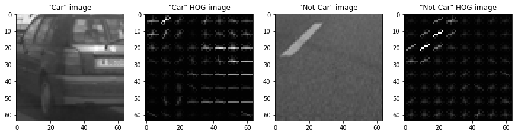
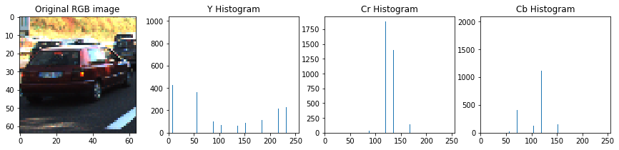
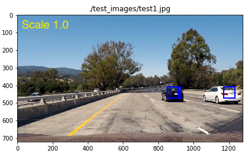
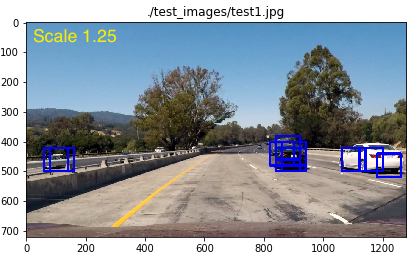
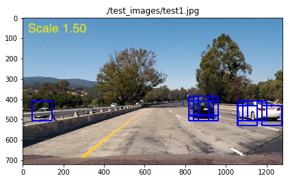
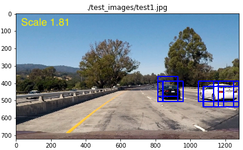
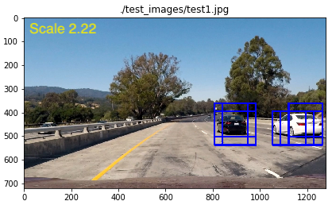
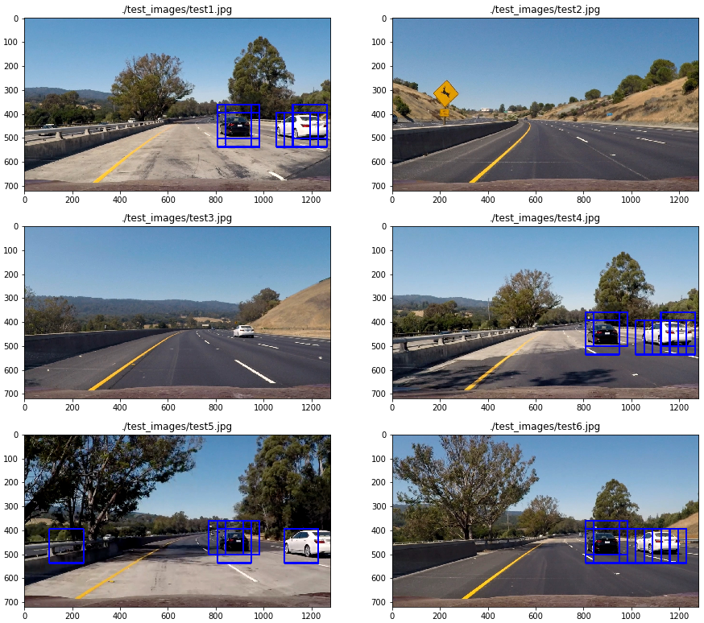
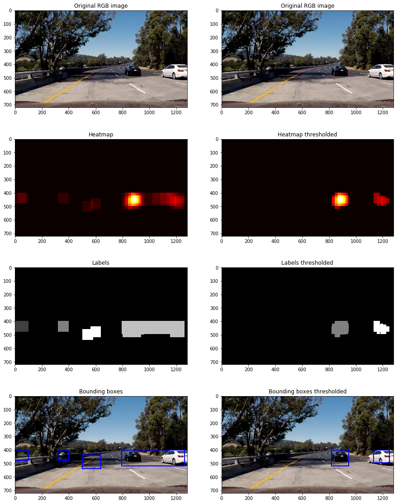

# Vehicle Detection Project [P5]
### Summary by Michael Berner, Student @ Udacity Self Driving Car NanoDegree 2018

[](http://www.udacity.com/drive)

Stuttgart, June 19th 2018

---

**Vehicle Detection Project**

The goals / steps of this project are the following:

* Perform a Histogram of Oriented Gradients (HOG) feature extraction on a labeled training set of images and train a Linear SVM classifier
* Optionally, you can also apply a color transform and append binned color features, as well as histograms of color, to your HOG feature vector. 
* Note: for those first two steps don't forget to normalize your features and randomize a selection for training and testing.
* Implement a sliding-window technique and use your trained classifier to search for vehicles in images.
* Run your pipeline on a video stream (start with the test_video.mp4 and later implement on full project_video.mp4) and create a heat map of recurring detections frame by frame to reject outliers and follow detected vehicles.
* Estimate a bounding box for vehicles detected.

[//]: # (Image References)
[image2]: ./examples/HOG_example.jpg
[image3]: ./examples/sliding_windows.jpg
[image4]: ./examples/sliding_window.jpg
[image5]: ./examples/bboxes_and_heat.png
[image6]: ./examples/labels_map.png
[image7]: ./examples/output_bboxes.png
[video1]: ./project_video.mp4

## Rubric Points
### Here I will consider the rubric points individually and describe how I addressed each point in my implementation.  

This writeup is closely linked to the actual Udacity [rubric](https://review.udacity.com/#!/rubrics/513/view) for this project.

---
### Writeup / README

#### 1. Provide a Writeup / README that includes all the rubric points and how you addressed each one.  You can submit your writeup as markdown or pdf. 

I replaced the README.md file on GitHub with my write-up. This way, by browsing the project on GitHub, you will immediately see the WriteUp and how I approached and solved the project. 

For this project I decided to provide two IPython notebooks. 

The first one is called `P5_Preparation.ipynb` and is holding all the preparational materials which I have developed for this project. The trained SVM (Support Vector Machine) is being generated in this notebook and stored as a Pickle file `svm_scaler_result.pkl`.

The second notebook is called `P5_Final.ipynb` and holds the final code of the project. This notebook processes the video and relies on the previously generated trained SVM pickle file.

### Histogram of Oriented Gradients (HOG)

#### 1. Explain how (and identify where in your code) you extracted HOG features from the training images.

I started by reading in all the `vehicle` and `non-vehicle` images.  Here is an example of one of each of the `vehicle` and `non-vehicle` classes:



The actual feature extraction functions can be found in the cells 1c and 1d for the training images of `P5_Preparation.ipynb`. 

##### Balancing
The dataset consisted of **8968** car images and **8792** not-car images. With a quantitative difference of approximately 2%, the dataset was already balanced quite well. Further adjustments to balance the datasets even more were therefore not necessary. 

##### HOG feature extraction
For HOG feature extraction, the function `skimage.hog()` was applied and the following parameters were altered:

* `orientation`: in the range from 6 to 12
* `pix_per_cell`: in the range from 6 to 10
* `cell_per_block`: in the range from 1 to 4
* `hog_channel`: 1st, 2nd, 3rd or all channels 

Before passing the images to the HOG feature extraction, I also tried whether a different color space might yield better results. The color channels RGB, HSV, LUV, HLS, YUV, YCrCb were tried. 

Here is an example using the first channel of `YCrCb` color space and HOG parameters of `orientations=8`, `pixels_per_cell=(8, 8)` and `cells_per_block=(2, 2)`:




#### 2. Explain how you settled on your final choice of HOG parameters.

##### Splitting the dataset

The quality of the parameters was assessed by shuffling splitting the dataset into roughly 80% training data and 20% test data by using the function `train_test_split()` from `sklearn` library. 

##### Quality assessment

I tried various combinations of parameters from within the range mentioned above. Every set of parameters was rated by looking at the achieved accuracy on the test data set. 

##### Final HOG parameters

* `orientation`: 8
* `pix_per_cell`: 8
* `cell_per_block`: 2
* `hog_channel`: all three channels


#### 3. Describe how (and identify where in your code) you trained a classifier using your selected HOG features (and color features if you used them).

##### Additionally included feature sets

By only extracting HOG features, the overall accuracy was well below 90% accuracy. I therefore decided to include additional features such as spatial features (size 32x32 pixel) and color histogram features (16 bins).

Below you can see an example for a color histogram for each color channel from a single image. The original image was converted to YCrCb color space (the chosen color space which showed best results overall) before histograms were created. 



I stacked all three feature sets and normalized them using the `StandardScaler()` function from the `sklearn` toolbox. Finally, the array was flattened.

The code for these operations can be found in section 1e of `P5_Preparation.ipynb`.

##### Training the SVM
For training the SVM, the function `LinearSVC()` from `sklearn` toolbox was used with no additional parameters set.

After all optimizations, an **overall accuracy >99.2%** was achieved.

The parameters, the linear scaler and the trained SVM were stored in the pickle file `svm_scaler_result.pkl`, which is later used by the `P5_Final.ipynb` IPython notebook.

In section 1f of `P5_Preparation.ipynb` these steps can be found.

### Sliding Window Search

#### 1. Describe how (and identify where in your code) you implemented a sliding window search.  How did you decide what scales to search and how much to overlap windows?

Since the relevant features (cars) of this project are typically found on the road, I decided to pass only the image area in y direction from pixel 400 (horizon) to 656 (upper end of the hood). The remaining height is a multiple of 64 pixels, which is the dimension of the training images used to train the SVM and helps the algorithm to perform more efficient.

Within this picture area, a sliding window search based on two parameters was applied:

* `scale`: scaling factor for the actual size of a search window as multiples of 64x64
* `cells_per_step`: amount of cells (cell size = 8x8) the search window is shifted while searching

Vehicles, which are closer to the camera, are clearly larger than 8x8 cells (64x64 pixels). Therefore, it was necessary to run the sliding window search multiple times with different `scale` factors applied to it. For preparation of the final script version, the sliding window search was applied 5 times using the following `scale` factors:

| Scale   | Effective window size [pixels] |
| :-----: | :-----: |
| 1.0000  | 64x64 |
| 1.2500  | 80x80 |
| 1.5000  | 96x96 |
| 1.8125  | 116x116 |
| 2.2188  | 142x142 |

The corresponding search window sizes are exemplarily shown in the following pictures:







The final sliding window search algorithm can be found in code cell `Actual pipeline` of `P5_Final.ipynb` in the functions `process_image()` and `detect_cars()`. 


#### 2. Show some examples of test images to demonstrate how your pipeline is working.  What did you do to optimize the performance of your classifier?

Ultimately I searched on 5 scales using YCrCb 3-channel HOG features, spatially binned color and histograms of color in the feature vector, which provided a the above mentioned accuracy on the test data set of >99.2%. Here are some example images using a scale of 2.2188:



On image `test3.jpg`, a **false negative** detection is visible. This is due to the large scale (2.2188) which was applied. By applying a smaller scale, this false negative disappears again. In a later stage, when multiple scales are applied and combined to a heat map, you can get rid of this false reading. 

Occasionally, as visible on image `test5.jpg`, you can also see a **false positive** detections. The reduction of false positives takes place later in the video implementation and is explained in the following chapter.

Overall, the vehicles were detected quite well on the test images. This shows, that the SVM is working as intended.

---

### Video Implementation

#### 1. Provide a link to your final video output.  Your pipeline should perform reasonably well on the entire project video (somewhat wobbly or unstable bounding boxes are ok as long as you are identifying the vehicles most of the time with minimal false positives.)

Here's a [link to my video result](./out_final.mp4). It can also be watched on [YouTube](https://youtu.be/QomfCJwqvNA).


#### 2. Describe how (and identify where in your code) you implemented some kind of filter for false positives and some method for combining overlapping bounding boxes.

I recorded the positions of positive detections in each frame of the video. From the positive detections I created a heatmap and then thresholded that map two times:

1. with an absolute pass criteria on the heat map (pass: >= 2 detections)
2. with a relative pass criteria (pass: >= 0.2*max heat map value)

The code lines for this can be found in the function `process_image()`, line 88 to 92:

```
# Store heatmap in double ended queue buffer
# Calculate averaged heatmap over 10 frames (i.e. buffer size)
buffer.append(heatmap)
heatmap_avg = np.average(buffer,0)
heatmap_avg = apply_threshold(heatmap_avg, np.max(heatmap_avg)*0.2)
heatmap_avg = apply_threshold(heatmap_avg, 3)
```    

After this step, I used `scipy.ndimage.measurements.label()` to identify individual blobs in the heatmap and apply a label to each heatmap. The idea is, that each blob is supposed to correspond to a vehicle. I constructed bounding boxes to cover the area of each blob detected.

Here's an example result showing the heatmap based on the test image dataset. The image's purpose is to show the impact of thresholding to remove false positives.



It can be clearly seen, that double thresholding (absolute and relative) was in fact removing lots of false positives and also helped separating the vehicles from each other.

However, if the video was processed with the steps mentioned above, there were still many frames where vehicles were not detected at all, i.e. **false negatives**. I was able to solve this issue by adding a buffer, which was holding the detections from the last 10 frames. 


---

### Discussion

#### 1. Briefly discuss any problems / issues you faced in your implementation of this project.  Where will your pipeline likely fail?  What could you do to make it more robust?

It was a lot of fun to train the SVM and tweak the parameters, since the SVM was quickly achieving high accuracys. 

My pipeline is likely failing for cars that are very far away. This is due to the search window size. I decided to skip very small ones to keep the performance of the script up as much as possible. 

One improvement I would really like to introduce is a better separation of the cars, especially when they are very close together. One idea to achieve this is to check the size of the detected label. As soon as it is 2 times as long as high, split in the middle.

Furthermore, there still remain some false negative and false positive readings, which could be reduced with further parameter optimization. 

##### Potential speed improvements

While writing this summary, one further option for speed improvement came to my mind. 

Search windows with a certain scale should only be applied in areas, where the cars are likely to have the approximate search window size! Currently, the script is applying the small search windows also at the bottom of the image, which does not make too much sense. This could be limited to areas, where vehicles are actually that small. I guess this could yield a 5x speed boost. 

Since for the video a buffer for averaging over video frames was applied, further parameters might be tweaked towards higher calculation speed. E.g smaller overlap, fewer different scales etc. Speed boost likely in the order of 3x-10x.

Definitely, my first step would be to install some sort of profiling tool (e.g. `line_profiler`) and do a proper line per line speed profiling assessment. Usually, this reveals very quickly which lines of code need optimization.

##### Conclusion

Overall, a fun project to work on! It's amazing to see what is achievable with a few hundred lines of code! 

Thank you Udacity for this great experience!